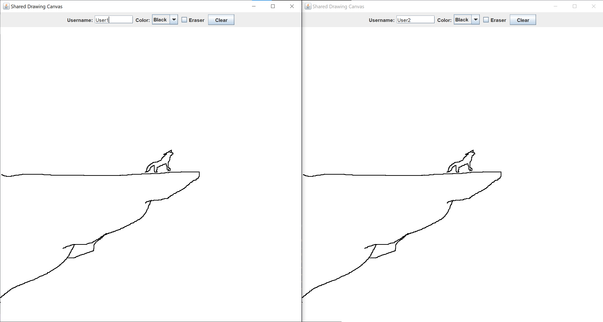

# Shared Drawing Canvas 🎨

A real-time collaborative drawing application with client-server architecture, allowing multiple users to draw on a shared canvas simultaneously.

## Features

### Client Features

- ✏️ Real-time drawing with mouse
- 🎨 Color selection (Black, Red, Green, Blue)
- 🧽 Eraser functionality
- 🧹 Clear canvas option
- 👤 Username customization
- 📡 Network synchronization

### Server Features

- 🌐 Multi-client support
- 🔄 Real-time command broadcasting
- 💻 Connection management
- 📶 Network synchronization

## Components

1. **DrawServer.java** - Central server that broadcasts drawing commands
2. **DrawClient.java** - Client application with GUI interface
3. **DrawCommand.java** - Serializable command object for network transmission

## How to Run

1. **Start the server**:

   ```bash
   java DrawServer.java
   ```

2. **Start the client**:

   ```bash
   java DrawClient.java
   ```

## Usage Instructions

1. Launch the server first
2. Launch one or more client instances
3. On each client:
   - Set your username
   - Select drawing color
   - Toggle eraser mode if needed
   - Draw by clicking and dragging
   - Use "Clear" button to reset canvas

## Example Output


